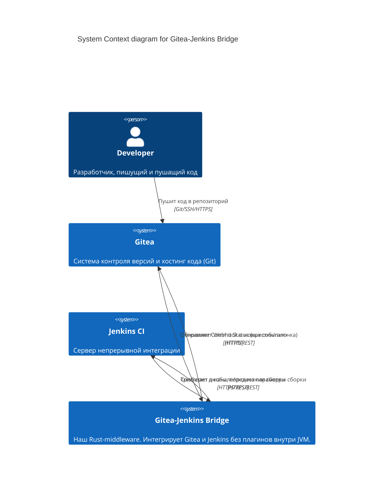
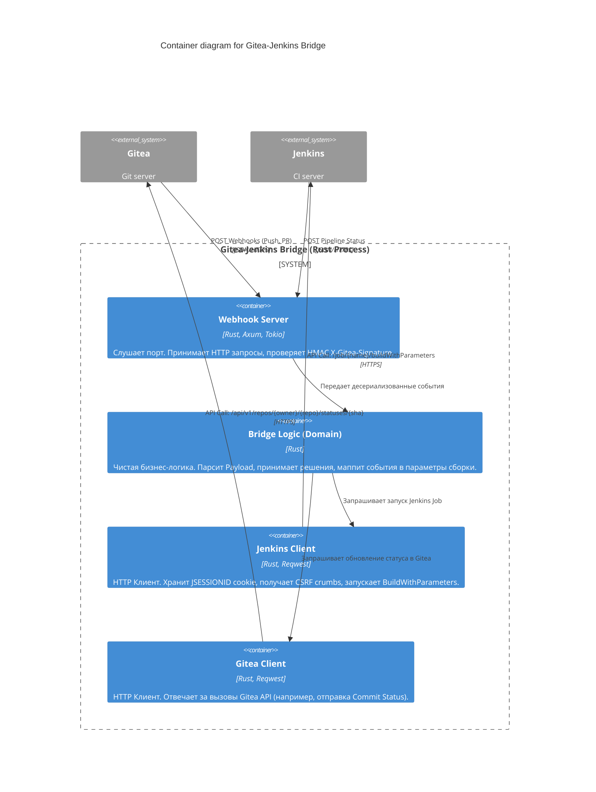
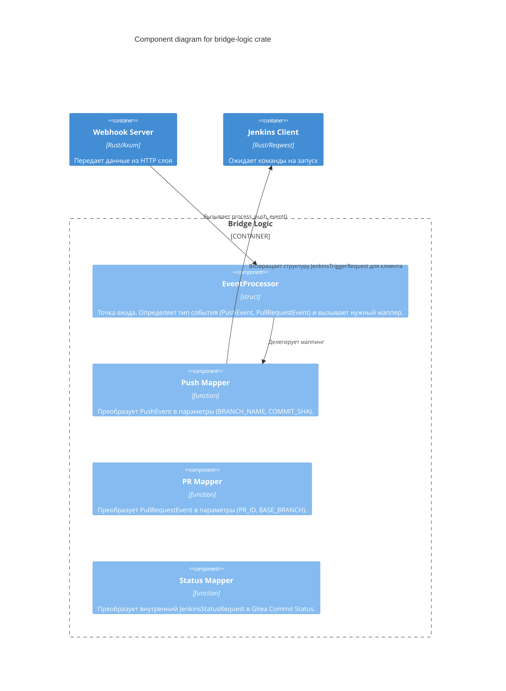

# Архитектура в нотации C4 (C4 Model)

В данном документе описана архитектура моста `gitea-plugin-rs` с использованием подхода [C4 Model](https://c4model.com/), визуализированная через Mermaid.

## Уровень 1: System Context (Контекст системы)
Показывает высокоуровневое взаимодействие системы со своими внешними зависимостями и пользователями.

## Уровень 2: Container (Контейнеры системы)
Раскрывает архитектуру самого моста, показывая его основные контейнеры (в нашем случае это логические крейты Rust, запускаемые в одном процессе/контейнере Docker).

## Уровень 3: Component (Компоненты)
Демонстрирует внутреннюю структуру главного слоя бизнес-логики (`bridge-logic`).

> **Примечание:** Уровень 4 (Code) в C4 обычно не рисуется, так как он слишком детализирован, и его роль выполняют UML диаграммы классов или сам исходный код. В Rust эту роль отлично выполняет `cargo doc`.
